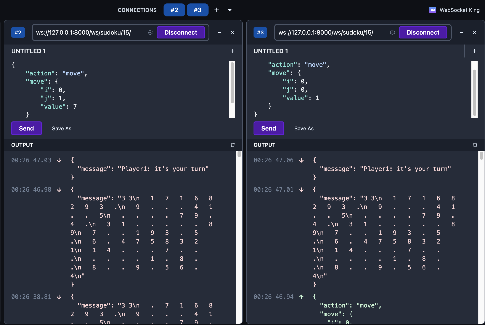

# Competitive Sudoku: Play Against AI or Friends!

## Description

Hey there! Ever thought Sudoku could be a competitive game? Well, now it can be. This whole idea started during my Foundation of AI course at TU/e. We played around with some cool AI algorithms like minimax, heuristics, and monte carlo tree search. I thought, "Why not make this a real game?" So, here we are. The final goal is to make it like chess.com, but Sudoku style.

## How's It Played?

Competitive Sudoku is a two-player adversarial game. You and your opponent take turns, filling out a Sudoku grid. You score by completing rows, columns, or blocks. Finish the puzzle, and if you've got the most points, you win!

Here's the point breakdown:

| Regions Completed | Points Scored |
| ----------------- | ------------- |
| 0                 | 0             |
| 1                 | 1             |
| 2                 | 3             |
| 3                 | 7             |

Full rules? will come soon.

## What's the Status?

Got the basics down, but there's a lot more to come (you'll see some TODOs in the code). For now, you can give it a try on WebSocket tools like WebSocketKing.

