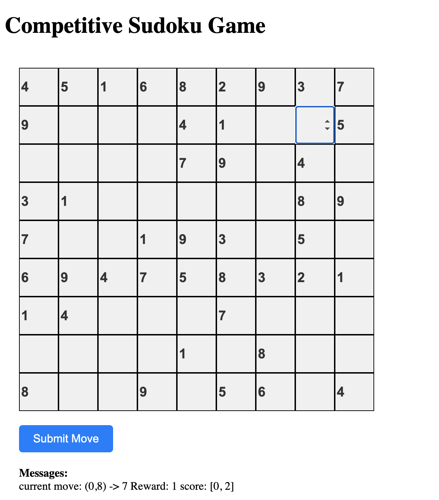
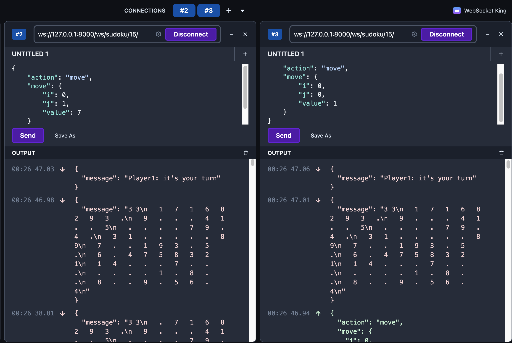

# Competitive Sudoku

## Description

Ever thought Sudoku could be a competitive game? Well, now it can be. This whole idea started during my Foundation of AI course at TU/e. We played around with some cool AI algorithms like minimax, heuristics, and Monte Carlo tree search. I thought, "Why not make this a real game?" So, here we are. 
<!-- The goal is to make it like chess.com, but Sudoku style. -->

## How's It Played?

Competitive Sudoku is a two-player adversarial game. You and your opponent take turns, filling out a Sudoku grid. You score by completing rows, columns, or blocks. Finish the puzzle, and if you've got the most points, you win!

Here's the point breakdown:

| Regions Completed | Points Scored |
| ----------------- | ------------- |
| 0                 | 0             |
| 1                 | 1             |
| 2                 | 3             |
| 3                 | 7             |

## What's the Progress?

Up Next: Gameboard generation, Game mode selection, Improved user/game management, Deployment, Enhanced frontend UI, etc.

New Laptop Git test

Dec 13, 2023: Got the AI microservice and Referee integrated to the game, and basic frontend completed. For now, you can play it with AI visually through your browser.

Aug 24, 2023: Got the basics down, but there's a lot more to come (you'll see some TODOs in the code). For now, you can give it a try on WebSocket tools like WebSocketKing.

